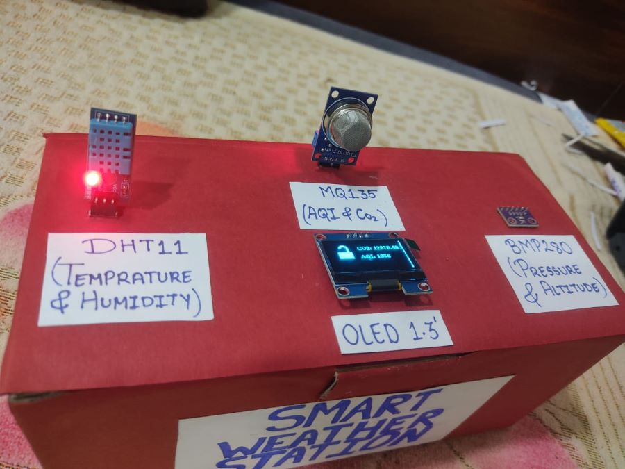
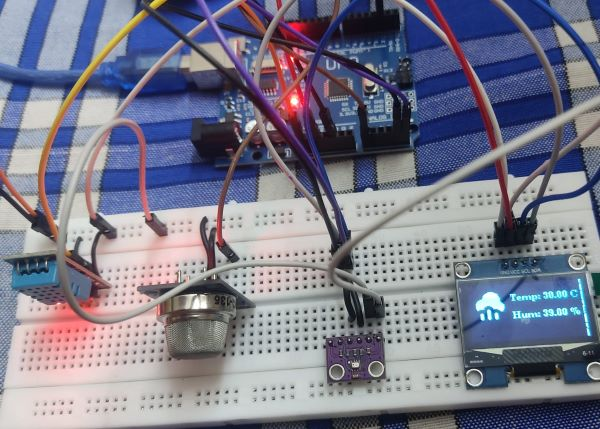

# Weather Station with AQI Monitoring 🌦️💨

## 📌 Project Overview

This **Weather Station with AQI Monitoring** is an Arduino-based project designed to measure and display real-time environmental parameters such as:

- 🌡️ **Temperature & Humidity** (DHT11)
- ⛰️ **Altitude & Pressure** (BMP280)
- 🌫️ **Air Quality & CO₂ Levels** (MQ135)

The data is displayed on a **1.3-inch OLED screen**, providing a clean and user-friendly interface.

---

## 🚀 Features

✅ **Real-Time Sensor Readings**\
✅ **OLED Display for Live Data**\
✅ **Compact & Energy Efficient**\
✅ **AQI Calculation for Pollution Awareness**\
✅ **Interactive Cloud Animation for Aesthetic Appeal**\
✅ **Calibrated for Local Pressure & Altitude (Ahmednagar, India)**

---

## 🛠️ Components Used

- **Arduino Nano** (Microcontroller)
- **DHT11** (Temperature & Humidity Sensor)
- **BMP280** (Barometric Pressure & Altitude Sensor)
- **MQ135** (Air Quality Sensor for CO₂ & AQI)
- **1.3'' OLED Display** (128x64 Monochrome)
- **Jumper Wires & Breadboard**

---

## 📷 Project Preview



---

## 🏗️ Wiring Diagram



| **Component** | **Arduino Pin** |
| ------------- | --------------- |
| DHT11 Data    | D2              |
| BMP280 SCL    | A5              |
| BMP280 SDA    | A4              |
| MQ135 A0      | A0              |
| OLED SCL      | A5              |
| OLED SDA      | A4              |

---

## 🔧 Installation & Setup

### **1️⃣ Install Required Libraries**

Make sure you have these libraries installed in the Arduino IDE:

```bash
Adafruit BMP280 Library
Adafruit Unified Sensor Library
DHT Sensor Library
U8g2 Library
MQ135 Library
